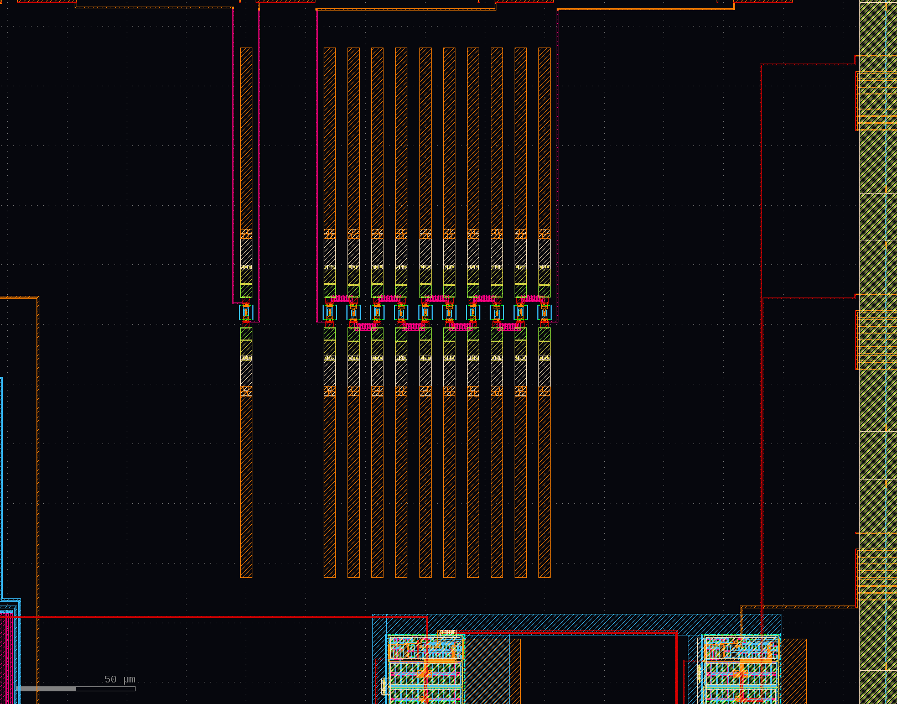


###################
mmW diode detectors
###################

there are two diode-detector designs to measure if serial circuits of detector diodes will increase the sensitivity of the sensor.

layout
######

\

