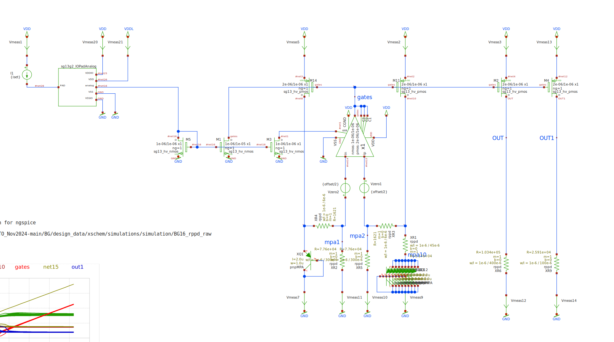
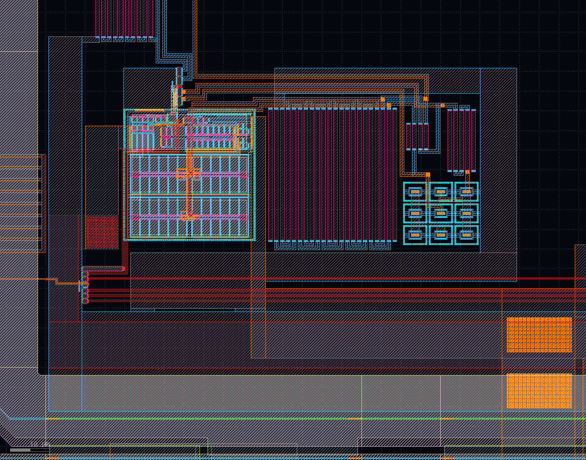


******************
band gap reference
******************

the shunt-regulator has to limit the supply-voltage to 3.3V. it should be usable to 50mA.

SCHEMATiC

LAYOUT

SiMULATiON

:download:`PDF with Xyce simulation <_static/BG16_rppd_raw.pdf>`

LVS
***

LVS wasn't working. and there are differences between layout and schematics
