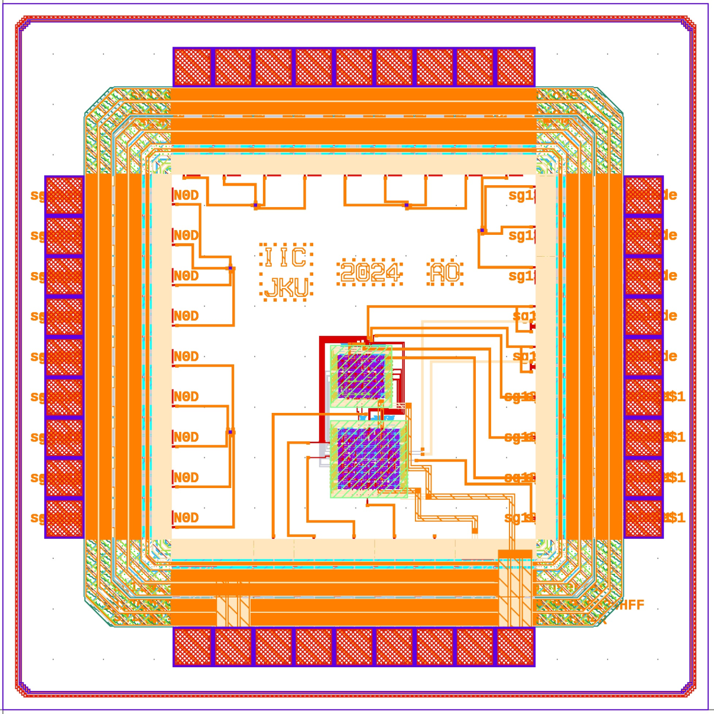

# JKU Test Chip 2 (November 2024)

This chip was designed by the Department for Integraed Circuits (ICD) from Johannes Kepler University Linz.

# Circuits

Designed by Ali Olyanasab

- Pulse manipulation digital block

- Shift register with parallel output

- Custom JFET devices (x5)
