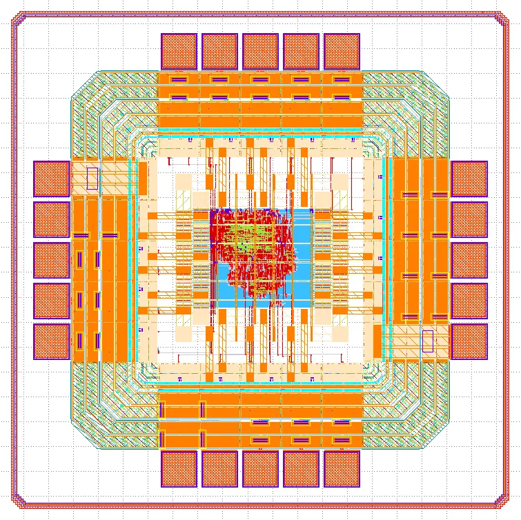

End-to-end Open-Source I2C GPIO Expander
========================================

Welcome to the documentation for the end-to-end Open-Source I2C GPIO Expander!

This guide is organized into the following chapters:

.. toctree::
   :maxdepth: 1
   
   design.rst
   pinout.rst
   known-issues.rst

