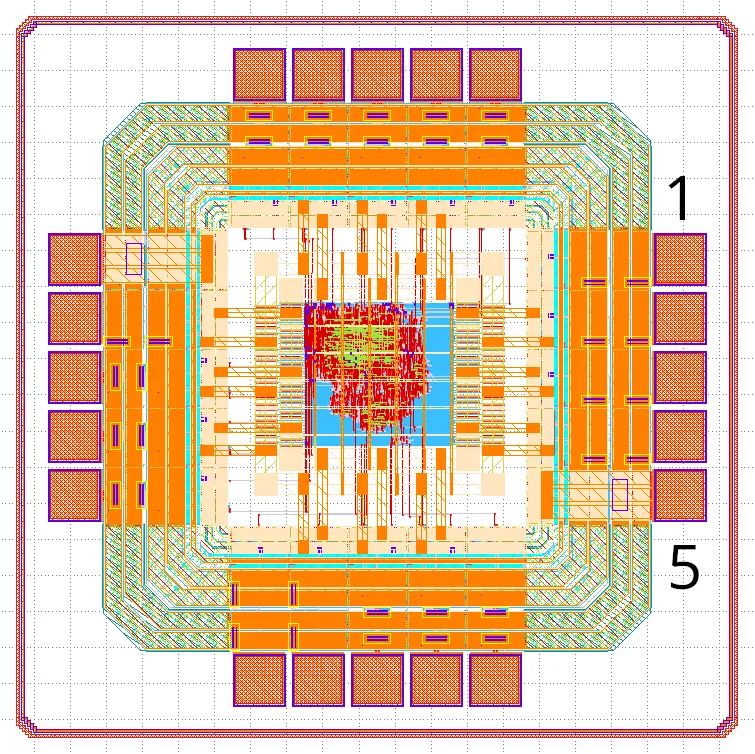

Chip Pin-Out
============

The image below highlights the location of pin 1 on the chip.

The table that follows provides a detailed explanation of each I/O pin's function.

.. list-table:: Pin-Out
   :stub-columns: 1

   * - Pin
     - Position
     - Name
     - IO
     - Function
   * - 1
     - East
     - VDD
     -
     - Ground
   * - 2
     - East
     - VSS
     -
     - 1.1V
   * - 3
     - East
     - io_address_0
     - I
     - I2C Device address bit 0.
   * - 4
     - East
     - io_address_1
     - I
     - I2C Device address bit 1.
   * - 5
     - East
     - io_address_2
     - I
     - I2C Device address bit 2.
   * - 6
     - South
     - io_clock
     - I
     - 50 MHz input clock.
   * - 7
     - South
     - io_reset
     - I
     - Active-low reset signal.
   * - 8
     - South
     - io_i2c_scl
     - IO
     - I2C Open-Drain SCL signal. Requires external pull-ups.
   * - 9
     - South
     - io_i2c_sda
     - IO
     - I2C Open-Drain SDA signal. Requires external pull-ups.
   * - 10
     - South
     - io_i2c_interrupt
     - O
     - I2C interrupt to external controller.
   * - 11
     - West
     - io_gpio_5
     - IO
     - GPIO Pin 5
   * - 12
     - West
     - io_gpio_6
     - IO
     - GPIO Pin 6
   * - 13
     - West
     - io_gpio_7
     - IO
     - GPIO Pin 7
   * - 14
     - West
     - VSS
     -
     - Ground
   * - 15
     - West
     - VDD
     -
     - 1.1V
   * - 16
     - North
     - io_gpio_0
     - IO
     - GPIO Pin 0
   * - 17
     - North
     - io_gpio_1
     - IO
     - GPIO Pin 1
   * - 18
     - North
     - io_gpio_2
     - IO
     - GPIO Pin 2
   * - 19
     - North
     - io_gpio_3
     - IO
     - GPIO Pin 3
   * - 20
     - North
     - io_gpio_4
     - IO
     - GPIO Pin 4
